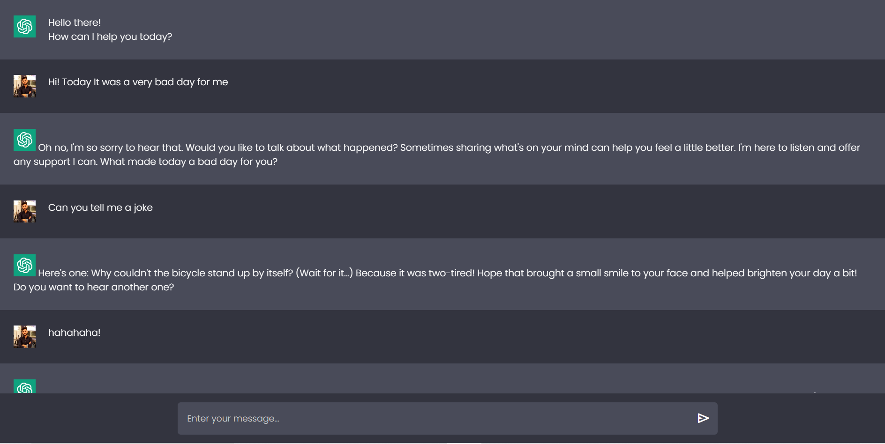

# Groq Conversational Chatbot using FastAPI

## Overview
This project is a lightweight and scalable conversational chatbot that utilizes **Groq** for natural language processing and **FastAPI** as the backend. The chatbot handles user queries and provides conversational responses with an interactive frontend built using HTML, CSS, and JavaScript. It is designed for seamless interaction and easy scalability, making it suitable for various conversational use cases.

## Key Features
- **FastAPI Backend**: High-performance backend framework that enables fast development and scalability.
- **Groq API Integration**: Delivers highly accurate and engaging conversational experiences using Groq's AI models.
- **Interactive Frontend**: Simple and user-friendly interface developed with HTML, CSS, and JavaScript.
- **Scalable Architecture**: Easily extendable for custom conversational features and use cases.
- **Environment Configuration**: Secure management of API keys using environment variables.

## Tech Stack
- **Backend**: FastAPI, Python
- **Frontend**: HTML, CSS, JavaScript
- **AI/Chat API**: Groq API
- **Deployment**: Ready for deployment on platforms like Heroku, AWS, or Docker.

## Table of Contents
1. [Getting Started](#getting-started)
2. [File Structure](#file-structure)
3. [How It Works](#how-it-works)
4. [Future Enhancements](#future-enhancements)
5. [Contributing](#contributing)
6. [License](#license)

## Getting Started

### Prerequisites
Make sure you have the following installed:
- Python 3.8+
- FastAPI
- Pydantic
- Groq API Key (you can get one from [Groq's website](https://groq.com))
- Dotenv for managing environment variables

### Setup

1. Clone the repository:
    ```bash
    git clone https://github.com/yourusername/groq-chatbot-fastapi.git
    cd groq-chatbot-fastapi
    ```

2. Install the dependencies:
    ```bash
    pip install -r requirements.txt
    ```

3. Set up your environment variables:
   - Create an `.env` file inside the `app/` folder.
   - Add your Groq API key:
     ```bash
     GROQ_API_KEY=your_groq_api_key_here
     ```

4. Run the application:
    ```bash
    uvicorn main:app --reload
    ```

5. Open your browser and navigate to `http://127.0.0.1:8000/` to interact with the chatbot.

## How It Works
1. **Frontend**: The user interacts with the web interface (HTML, CSS, JavaScript) by submitting a message.
2. **Backend**: The message is sent to the FastAPI backend for processing.
3. **Groq API**: The FastAPI backend sends the message to the Groq API, which processes it and returns a response.
4. **Response**: The chatbot sends the response back to the frontend, where the user can view the reply and continue the conversation.

## Future Enhancements
- **Persistent Chat History**: Store chat conversations in a database for future reference.
- **Enhanced UI**: Improve the frontend design with additional styling and interactive elements.
- **Customizable Models**: Allow users to select from multiple AI models for different conversational experiences.

## Contributing
Contributions are welcome! Feel free to fork this project and submit a pull request with any improvements or suggestions. Please follow the standard GitHub workflow for contributing.

## License
This project is licensed under the MIT License. See the [LICENSE](LICENSE) file for more details.
